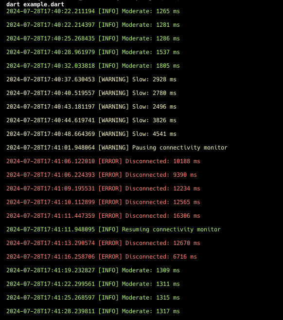

# flutter_connectivity
Constantly monitors and reports changes in connection quality to a specific server or service, built in pure Dart and compatible with Dart and Flutter.

Unlike other packages that only check internet connectivity, this one ensures actual internet access by testing against your designated server.
## Features

- [x] Select a server to test against (eg: example.com)
- [x] Configure interval for testing
- [x] Configure how many failed tests before reporting a connection loss
- [x] Set latency thresholds for different connection qualities
- [x] Get notified of connection quality changes in real-time
- [x] Pause and resume monitoring
- [x] Query connection history
- [x] Accommodates occasional network hiccups

Use this package when you need to:
- monitor connection quality
- maintain a stable connection
- detect network issues
- provide real-time feedback to users (eg: connection quality indicator)

## Getting started

1. Install the package

Dart
```bash
dart pub add flutter_connectivity
```
Flutter
```bash
flutter pub add flutter_connectivity
```
2. Import the package
```dart
import 'package:flutter_connectivity/flutter_connectivity.dart';
```

3. Create a new instance of `FlutterConnectivity` and start monitoring
```dart
// instantiate
FlutterConnectivity connectivity = FlutterConnectivity(endpoint: 'https://example.com');

// listen
connectivity.listenToLatencyChanges((ConnectivityStatus status, int latency) {
    print('Connection status: $status, latency: $latency');
});
```

## Screenshot


## Compatibility
Works with all Dart and Flutter (web, mobile, desktop) projects.

## Usage

**Create a new instance of `FlutterConnectivity`**

```dart
// Modify the endpoint to your server
FlutterConnectivity connectivity = FlutterConnectivity(endpoint: 'https://example.com');
```

**Optional: Configure the connectivity instance**
```dart
connectivity.configure(
    // How many failed requests before reporting a connection loss
    allowedFailedRequests: 2,
    
    // How often to check the connection
    checkInterval: const Duration(seconds: 3),
    
    // What kind of logs appear on your console
    logLevel: LogLevel.error,
);
```

**Optional: Configure latency thresholds**
```dart
// Set latency thresholds in milliseconds
connectivity.setLatencyThresholds(
    disconnected: 10000,
    slow: 5000,
    moderate: 2000,
    fast: 1000,
);
```

**Start the connectivity monitor**
```dart
connectivity.listenToLatencyChanges((ConnectivityStatus status, int latency) {
    print('Connection status: $status, latency: $latency');
});
```

**Pause and resume monitoring**
```dart
// Pause monitoring
connectivity.pause();

// Resume monitoring
connectivity.resume();
```

**Get history of latencies with timestamps**
```dart
Map<int, int> latencies = connectivity.latencyHistory;
```

**Stop monitoring**
```dart
connectivity.dispose();
```

Check out the [example](https://pub.dev/packages/flutter_connectivity/example) for a complete implementation. Run the example using the following command:
```bash
dart example/example.dart
```


## Additional information
Report issues and help improve the package on [GitHub](https://github.com/dev-kasibhatla/flutter_connectivity/issues).
Check [API reference](https://pub.dev/documentation/flutter_connectivity/latest/) for more detailed information.
